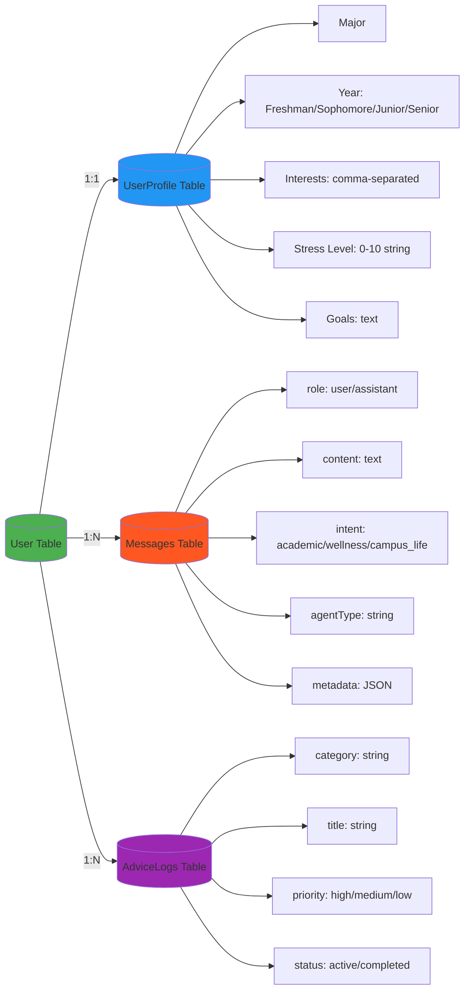
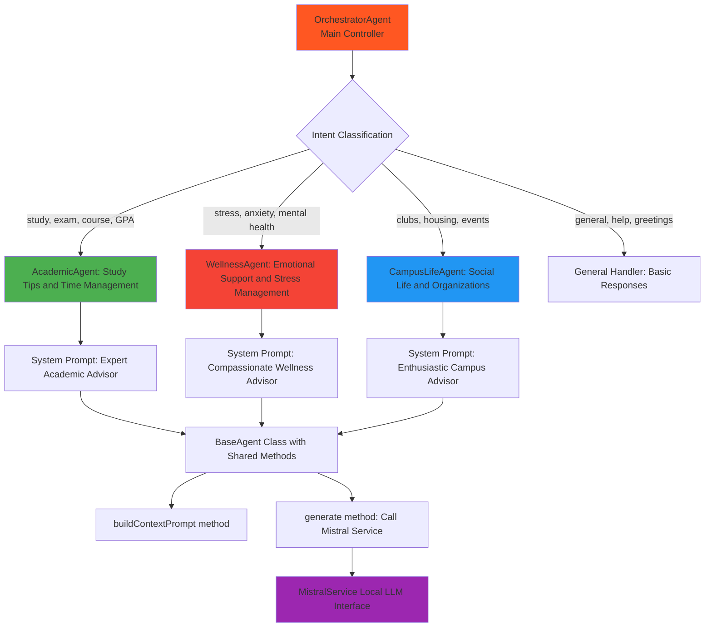
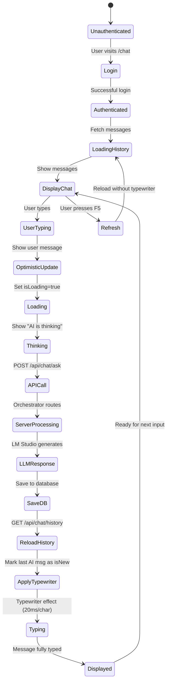
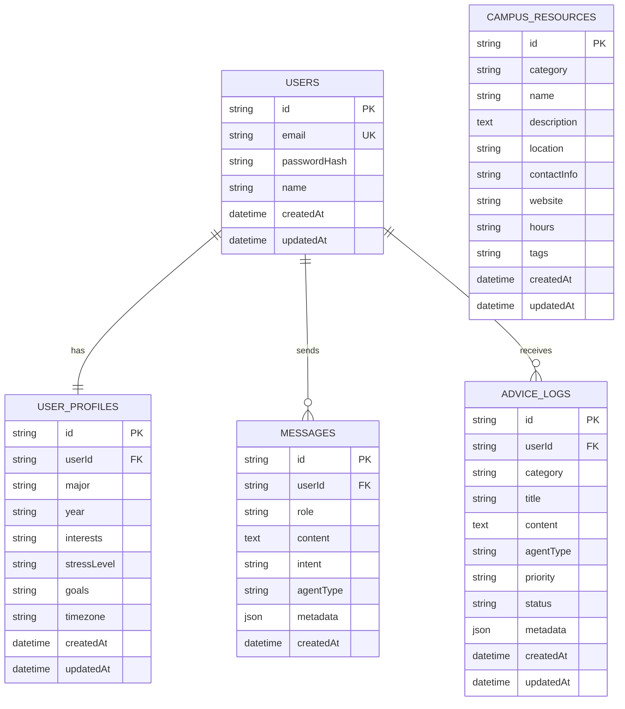
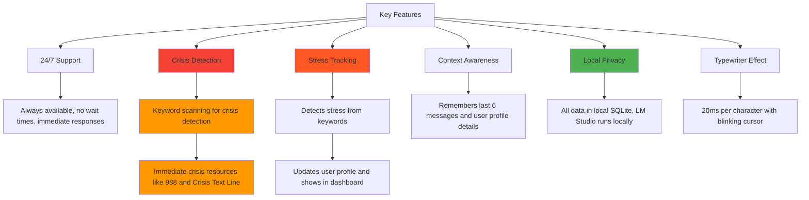

# College Advisor Chatbot Architecture

## System Workflow Diagram

```mermaid
flowchart TD
    Start([User Opens Chat]) --> Auth{Authenticated?}
    Auth -->|No| Login[Redirect to Login]
    Auth -->|Yes| LoadHistory[Load Chat History from DB]
    LoadHistory --> Display[Display Chat Interface]
    
    Display --> UserInput[User Types Message]
    UserInput --> OptimisticUI[Show User Message Immediately]
    OptimisticUI --> SetFlag[Set newestMessageId Flag]
    SetFlag --> SendAPI[POST /api/chat/ask]
    
    SendAPI --> GetSession[Verify Session & Get User ID]
    GetSession --> CreateOrchestrator[Create OrchestratorAgent]
    CreateOrchestrator --> BuildContext[Build User Context]
    
    BuildContext --> FetchProfile[Fetch User Profile]
    BuildContext --> FetchHistory[Fetch Last 10 Messages for Context]
    
    FetchProfile --> ContextReady[Context Ready]
    FetchHistory --> ContextReady
    
    ContextReady --> ClassifyIntent{Classify Intent}
    
    ClassifyIntent -->|Crisis Keywords| CrisisCheck{Crisis Detection}
    CrisisCheck -->|Crisis Detected| CrisisResponse[WellnessAgent: Crisis Response]
    
    CrisisResponse --> CrisisResources[Provide Immediate Resources: 988 Lifeline, Crisis Text Line, Campus Counseling]
    
    ClassifyIntent -->|Academic Keywords| AcademicAgent[AcademicAgent]
    ClassifyIntent -->|Wellness Keywords| WellnessAgent[WellnessAgent]
    ClassifyIntent -->|Campus Keywords| CampusAgent[CampusLifeAgent]
    ClassifyIntent -->|General| GeneralAgent[General Handler]
    
    AcademicAgent --> BuildPrompt1[Build Context Prompt with User Profile and History]
    WellnessAgent --> StressDetect{Detect Stress Level}
    CampusAgent --> BuildPrompt3[Build Context Prompt]
    
    StressDetect -->|High Keywords| UpdateStress1[Update Profile Stress Level to 8]
    StressDetect -->|Medium Keywords| UpdateStress2[Update Profile Stress Level to 6]
    StressDetect -->|Low Keywords| UpdateStress3[Update Profile Stress Level to 4]
    StressDetect -->|None| BuildPrompt2[Build Context Prompt]
    
    UpdateStress1 --> BuildPrompt2
    UpdateStress2 --> BuildPrompt2
    UpdateStress3 --> BuildPrompt2
    
    BuildPrompt1 --> LMStudio[Call LM Studio API]
    BuildPrompt2 --> LMStudio
    BuildPrompt3 --> LMStudio
    GeneralAgent --> LMStudio
    
    LMStudio --> MistralModel[Mistral-7B-Instruct v0.3 Local Model]
    MistralModel --> GenerateResponse[Generate Response with max 1024 tokens]
    
    GenerateResponse --> CombineContext[Combine System Prompt, User Context, and User Message]
    
    CombineContext --> AIResponse[AI Response Generated]
    CrisisResources --> SaveMessages
    
    AIResponse --> SaveMessages[Save to Database: User Message and Assistant Message]
    
    SaveMessages --> SaveUserMsg[(INSERT INTO messages with user role)]
    SaveMessages --> SaveAIMsg[(INSERT INTO messages with assistant role)]
    
    SaveUserMsg --> CheckAdvice{Generate Advice Log?}
    SaveAIMsg --> CheckAdvice
    
    CheckAdvice -->|Important Advice| SaveAdvice[(INSERT INTO advice_logs)]
    CheckAdvice -->|Regular Chat| ReturnResponse
    SaveAdvice --> ReturnResponse
    
    ReturnResponse[Return Response to Frontend]
    ReturnResponse --> ReloadHistory[Reload Chat History from Database]
    
    ReloadHistory --> ReverseOrder[Reverse Messages to Chronological Order]
    ReverseOrder --> FormatMessages[Format Messages with metadata]
    
    FormatMessages --> TypewriterCheck{isNew flag true?}
    TypewriterCheck -->|Yes| Typewriter[Apply Typewriter Effect at 20ms per character]
    TypewriterCheck -->|No| InstantShow[Show Message Instantly]
    
    Typewriter --> DisplayMessages[Display All Messages]
    InstantShow --> DisplayMessages
    
    DisplayMessages --> ClearFlag[Clear newestMessageId Flag after 100ms]
    ClearFlag --> AutoScroll[Auto-scroll to Bottom]
    AutoScroll --> Ready[Ready for Next Message]
    
    Ready --> UserInput

    style Start fill:#4CAF50
    style CrisisResponse fill:#f44336
    style CrisisResources fill:#ff9800
    style LMStudio fill:#2196F3
    style MistralModel fill:#9C27B0
    style SaveMessages fill:#FF5722
    style Typewriter fill:#00BCD4
    style Ready fill:#4CAF50
```

## Data Flow: User Profile & Context

## Multi-Agent System Architecture

## Frontend State Management

## Database Schema

## Key Features Flow

